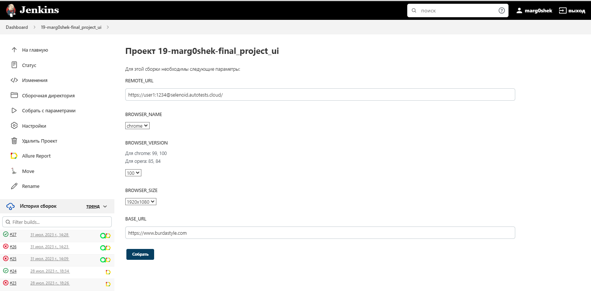
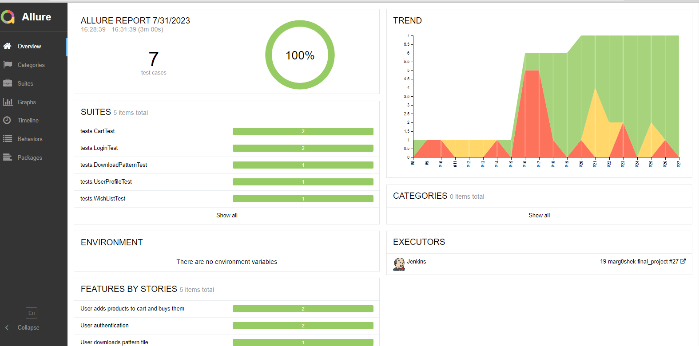
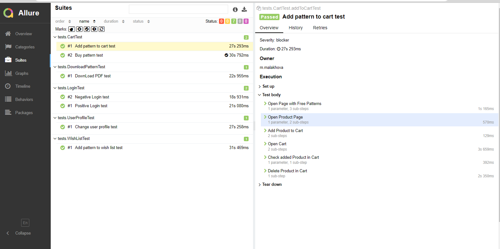
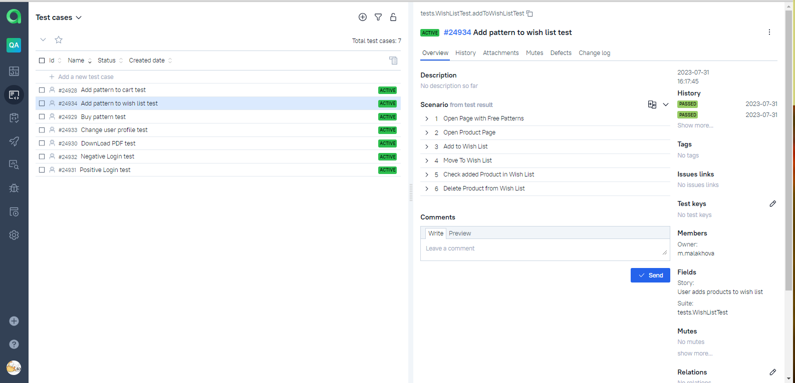
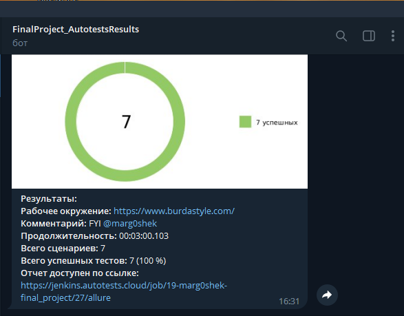

# Дипломный проект по автоматизации тестирования (WEB)

## 	Содержание

> ➠ [Общая информация о проекте](#общая-информация-о-проекте)
>
> ➠ [Запуск тестов из терминала](#запуск-тестов-из-терминала)
>
> ➠ [Запуск тестов в Jenkins](#удаленный-запуск-тестов-в-Jenkins)
>
> ➠ [Отчет о результатах тестирования в Allure Report](#-главная-страница-allure-отчета)
>
> ➠ [Tests as documentation в Allure Test Ops](#-тест-кейсы-в-allure-test-ops)
>
> ➠ [Уведомления в Telegram с использованием бота](#-уведомления-в-telegram-с-использованием-бота)
> 
> ➠ [Web приложение BurdaStyle](#web-приложение-burdastyle)
>  
##  Общая информация о проекте

### Запуск тестов из терминала

### Локальный запуск тестов

#### Локальный запуск тестов с использованием параметров из файла test.properties

```
gradle clean test
```

#### Описание параметров для запуска тестов
>
> -DbrowserName <code>название браузера</code>
>
> -DbrowserVersion <code>версия браузера</code>
>
> -DbaseUrl <code>url стенда фронта</code>
>
> -DbrowserSize <code>разрешение браузера</code>
>
> -DpageLoadTimeout <code>таймаут загрузки страницы</code>
>
> -Dtimeout <code>таймаут ожидания загрузки элемента страницы</code>
>
> -DisRemote <code>запуск тестов локально или через remote сервис</code>
>
> -DremoteUrl <code>url remote сервиса</code>

### Удаленный запуск тестов

#### Удалённый запуск через передачу параметров

```
gradle clean test 
-DremoteUrl=
-DbaseUrl=
-DbrowserName=
-DbrowserVersion=
-DbrowserSize=
-DisRemote=
-DpageLoadTimeout=
-Dtimeout=
```

##  Удаленный запуск тестов в Jenkins

> Для запуска тестов используется параметризированная сборка

<p align="center">

</p>

##  Главная страница allure отчета

<p align="center">

</p>

###  Группировка тестов по проверяемому функционалу

<p align="center">

</p>

###  Тест кейсы в Allure Test Ops

<p align="center">

</p>

##  Уведомления в Telegram с использованием бота

> После завершения сборки специальный бот, созданный в <code>Telegram</code>, автоматически обрабатывает и отправляет сообщение с отчетом о прогоне.
>
> Информация по настройке и использованию бота <code>https://github.com/qa-guru/allure-notifications</code>

<p align="center">

</p>

##  Web приложение BurdaStyle

###  Покрытый функционал web приложения BurdaStyle

> Разработаны автотесты на <code>UI</code>.
